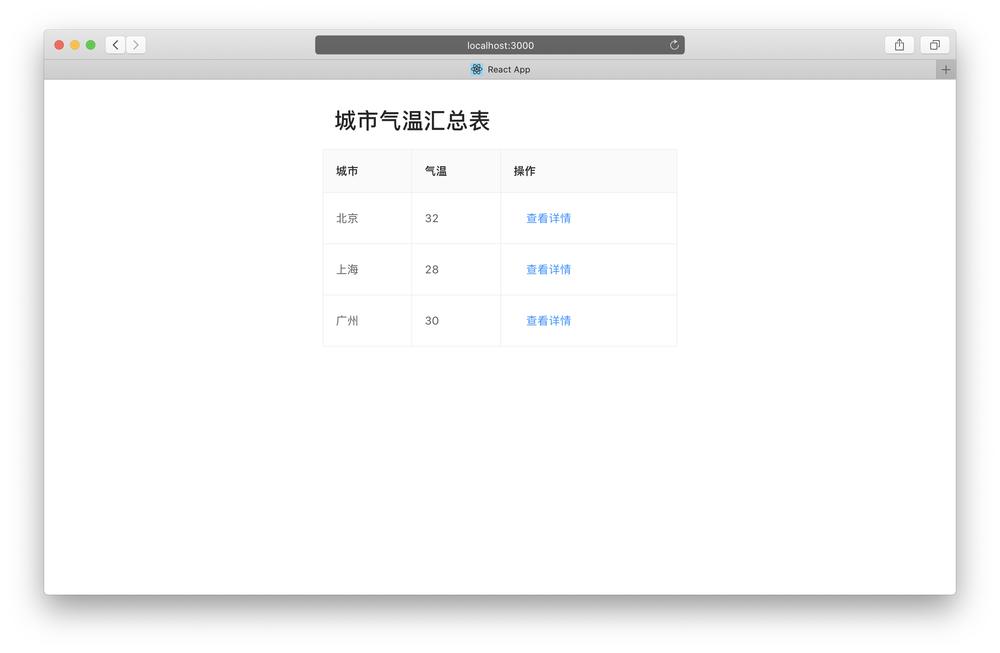
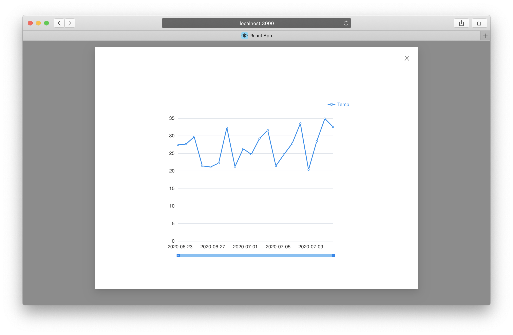

本文描述了通过 HTML iframe 组件进行物可视仪表盘嵌入的一种方案，供参考。

您可以通过在线预览和本地运行两种方式查看本方案。

# 1 在线预览

(待更新)

# 2 本地运行

:information_source: 本项目采用 [create-react-app](https://github.com/facebook/create-react-app) 构建。

## 2.1 知识储备

* 基本的 Javascript 和 React 开发知识
* 基本的 npm 使用能力

## 2.2 环境需求

您的电脑需要提供如下软件环境：

* nodejs 版本 >= 8.0.0
* 最新版的现代浏览器（推荐 Edge、火狐、谷歌浏览器）

## 2.3 运行方法

下载本项目：

```bash
git clone https://github.com/ZhaoMuwei/baidu-viz-iframe-demo.git
```

进入项目根目录并安装各种运行依赖：

```
npm i
```

启动项目：

```
npm start
```

该命令会自动打开系统默认浏览器并访问 [http://localhost:3000/](http://localhost:3000/)。

如您的默认浏览器不是上述“现代浏览器”，请手动更换浏览器，并访问该 URL。





# 3 联系方式

1. [百度云物可视官网](https://cloud.baidu.com/product/iotviz.html)
2. [iot-viz-rd@baidu.com](mailto:iot-viz-rd@baidu.com)
3. [百度云工单](https://ticket.bce.baidu.com/)

---
© 版权所有 百度云物可视团队
